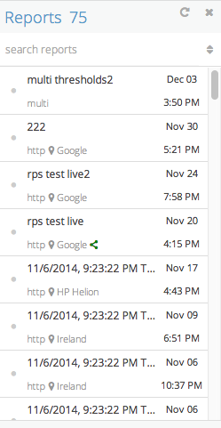

# Requirements

- `sidebar.json` - data file

# Tools to use

- Any Javascript tools, frameworks, libraries or code.

# Expected Result

Result should be a web page (html) that can include any style or script (using native or script loader)

Resulting page should work and look the same on all major browsers (Chrome, Firefox, IE 9+)

Result should try to match the expected screenshot as much as possible.

# Instructions

Load the attached `sidebar.json` using any Ajax method of your choice, can be done with the aid of a button, or page load, or whichever way you want.

What you are looking at in the expected result is actually a part of the Blazemeter application - a sidebar.

## General sidebar

1. It opens and closes, has an open width of `250px`.
2. `x` button closes it, and you can add any action item to open it to your choosing.
3. When it is closed - the sidebar is not visible on screen.
4. Make the sidebar full height of screen.
5. If the amount of items in the sidebar do not fit in the visible screen, it is scrollable
6. Refresh button reloads the data
7. Reports is a title for the sidebar, and alongside it is the count of the amount of reports from the supplied json.
8. Grid is sorted based on updated time, using `updated` field.
9. Button of up/down arrows to the right of the search toggles the sort order of the grid (ascending, descending). *(Optional)*
10. Below the title there is a search input box that will filter the sidebar data by using the `name` field. *(Optional)*

## Sidebar grid item

- Height is `53px`.
- Ignore icons and the dot on the left
- on middle top - shows `name` field
- on right side - `updated` as a formatted time (date on top, time on bottom)
- bottom row shows test type.
- location is taken from the `location` field.

**If you have any open questions about css/data - just assume whichever answer seems the most appropriate. Just go with the flow, the general idea and execution is much more important**

## What we check

- General design and concept
- Tools and libraries selections (overkill is a minus)
- Code quality and style
- Execution
- Css and UI quality
- General flow
- UI
- Overall working model

#### Good luck!